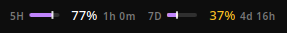
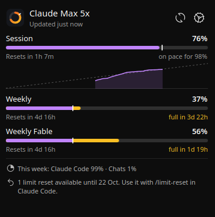
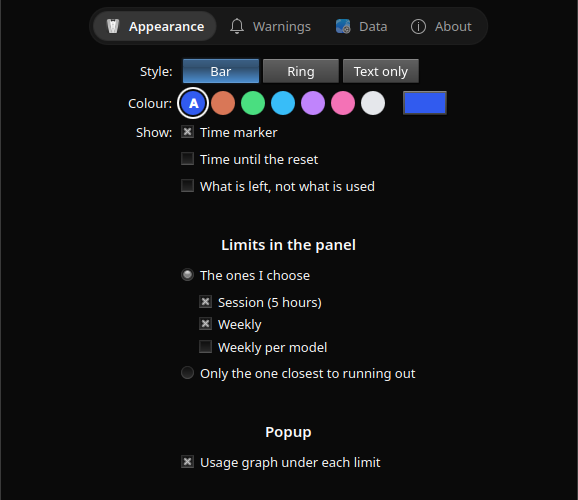

# burnbar

Claude Code usage limits in your KDE Plasma panel: how much is used, when it resets, and whether you will run out first.

<p align="center"></p>

<p align="center">
  
  
</p>

## Install

Needs KDE Plasma 6, Claude Code signed in with a Claude subscription (Pro, Max, Team), and [Bun](https://bun.sh) or Node.js 20+.

Download `burnbar-<version>.plasmoid` from [releases](https://github.com/snurfer0/burnbar/releases), then:

```sh
kpackagetool6 -t Plasma/Applet -i burnbar-*.plasmoid
```

Or from source, which also adds a `burnbar` terminal command:

```sh
git clone https://github.com/snurfer0/burnbar && cd burnbar && ./install.sh
```

Right-click the panel, **Add Widgets**, add **Burnbar**.

## Use

- Click the reading for every limit, its reset time and forecast. Middle-click to refresh.
- Settings: the gear in the popup. Changes apply as you make them.
- Burnbar tells you when an update is out; press **Update** in the popup to install it.

## Privacy

- Reads the login Claude Code keeps in `~/.claude`. Never changes or refreshes it.
- Talks to `api.anthropic.com` for usage and to GitHub once a day for updates (can be turned off in About). Nothing else.

## Uninstall

```sh
kpackagetool6 -t Plasma/Applet -r io.github.snurfer0.burnbar
rm -rf ~/.cache/burnbar ~/.local/state/burnbar ~/.local/bin/burnbar ~/.local/share/icons/hicolor/scalable/apps/burnbar.svg
```

## Notes

Linux only. Uses an endpoint Anthropic does not document, so it can break without notice. Not affiliated with Anthropic.

Development: `bun install`, `bun run check`, `bun run package`. The version lives in `plasmoid/metadata.json`; pushing a `vX.Y.Z` tag publishes a release.

MIT license.
